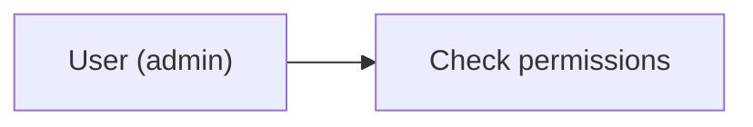
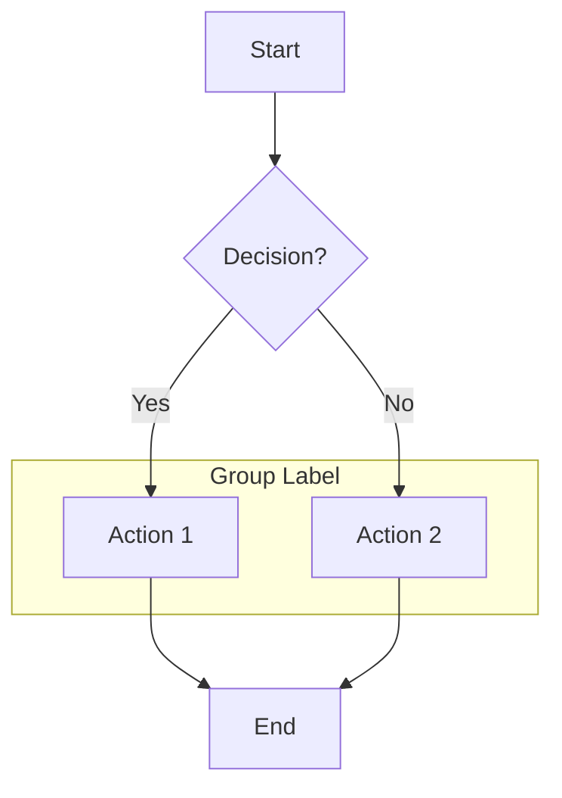
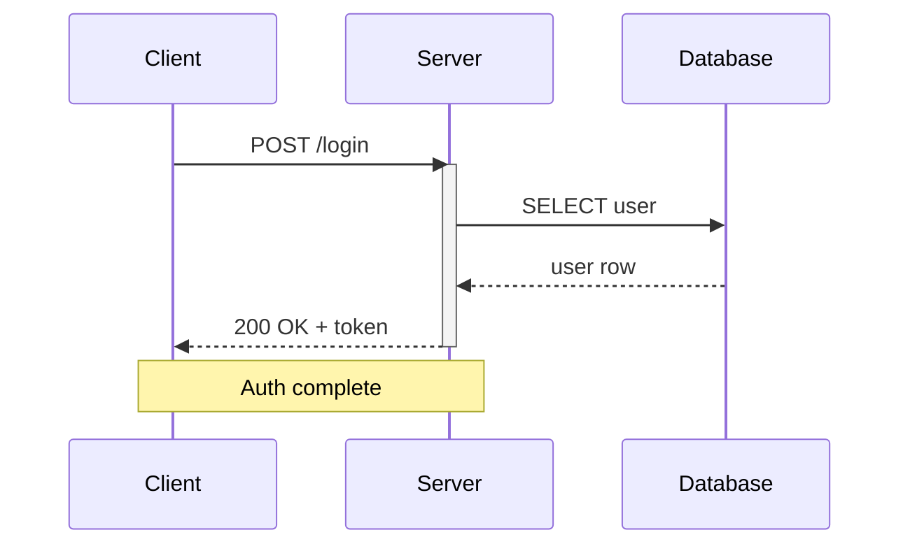
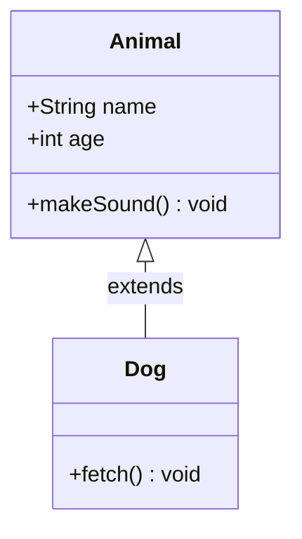
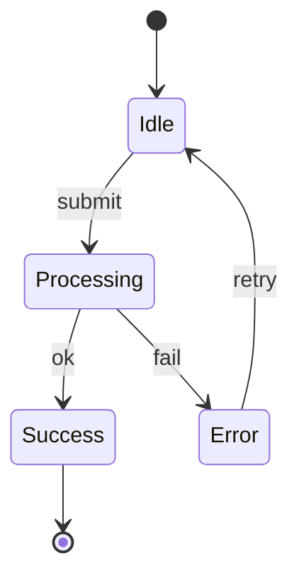
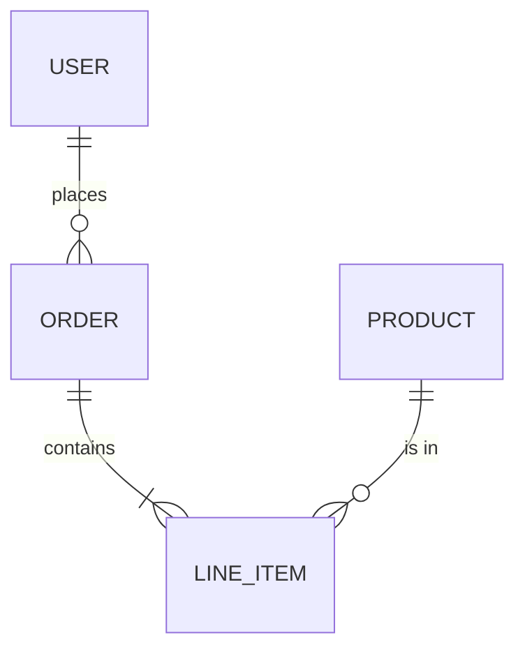
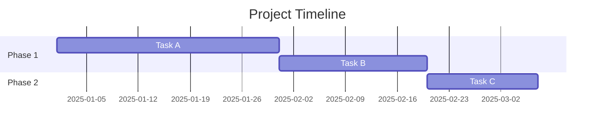
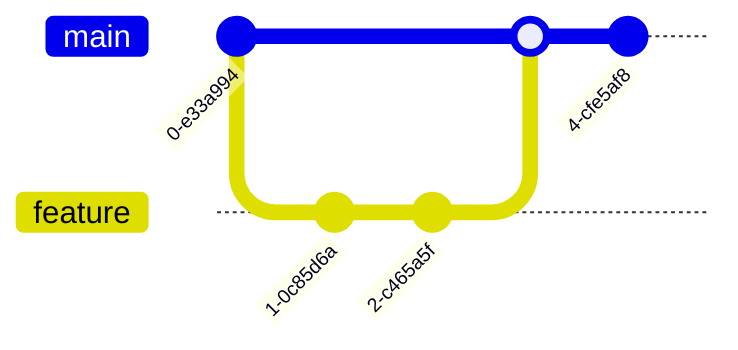

# Mermaid Diagram

## Critical Syntax Rules

These rules prevent the most common rendering failures.

### 1. Always quote labels with special characters

Any label containing spaces, punctuation, or reserved words **must** be wrapped in double quotes.



### 2. Never use bare special characters in node IDs

Node IDs must be alphanumeric (plus underscores). Use separate labels for display text.

```
✅  A["Process #1"] --> B["Step: validate"]
❌  Process #1 --> Step: validate
```

### 3. Declare diagram type on the first line

Every diagram must start with its type keyword. No blank lines before it.

```
✅  flowchart TD
❌  (blank line)
    flowchart TD
```

### 4. Use correct arrow syntax per diagram type

| Diagram | Solid arrow | Dotted arrow | Thick arrow |
|---------|------------|--------------|-------------|
| Flowchart | `-->` | `-.->` | `==>` |
| Sequence | `->>` (async) / `->` (sync) | `-->>` (async) / `-->` (sync) | N/A |

### 5. Avoid reserved words as bare IDs

Words like `end`, `graph`, `subgraph`, `class`, `state` must be quoted or aliased.

```
✅  endNode["end"]
❌  end --> next
```

---

## Quick Reference by Diagram Type

### Flowchart



**Direction keywords**: `TD` (top-down), `LR` (left-right), `BT` (bottom-top), `RL` (right-left)

**Node shapes**:

| Shape | Syntax | Example |
|-------|--------|---------|
| Rectangle | `A["text"]` | Default |
| Rounded | `A("text")` | Processes |
| Stadium | `A(["text"])` | Start/End |
| Diamond | `A{"text"}` | Decision |
| Hexagon | `A{{"text"}}` | Preparation |
| Circle | `A(("text"))` | Connector |
| Cylinder | `A[("text")]` | Database |

### Sequence Diagram



**Arrow types**: `->>` solid async, `->` solid sync, `-->>` dotted async, `-->` dotted sync

**Blocks**: `loop`, `alt`/`else`, `opt`, `par`/`and`, `critical`/`option`, `break` — all closed with `end`.

### Class Diagram



**Relationships**: `<|--` inheritance, `*--` composition, `o--` aggregation, `-->` association, `..>` dependency, `..|>` realization

### State Diagram



Use `stateDiagram-v2` (not `stateDiagram`). `[*]` marks start and end states.

### Entity Relationship Diagram



**Cardinality**: `||` exactly one, `o|` zero or one, `}|` one or more, `o{` zero or more

### Gantt Chart



Always include `dateFormat`. Task IDs enable `after` dependencies.

### Git Graph



Use `checkout` not `switch`. Branch names must not contain spaces.

---

## Validation (Required)

**Every generated diagram MUST be validated before presenting to the user.**

### Workflow

1. Write the diagram content to a temporary `.mmd` file
2. Run the validation script
3. If validation fails, fix the errors and re-validate
4. Only present the diagram after it passes validation

### How to validate

```bash
# Write diagram to a temp file
cat <<'DIAGRAM' > /tmp/diagram.mmd
flowchart TD
  A["Start"] --> B["End"]
DIAGRAM

# Validate it (installs mmdc automatically if missing)
bash ~/.cursor/skills/mermaid-diagram/scripts/validate.sh /tmp/diagram.mmd
```

- **Exit code 0** = diagram is valid, safe to present
- **Non-zero exit code** = syntax error — read stderr, fix the diagram, re-validate

### Fix loop

If validation fails:
1. Read the error output from `mmdc`
2. Apply the relevant fix from the Critical Syntax Rules above
3. Rewrite the `.mmd` file with the corrected diagram
4. Run validation again
5. **Do not present the diagram until it passes**

---

## Common Pitfalls Checklist

Before finalizing any diagram:

- [ ] First line is the diagram type keyword (no blank lines above)
- [ ] All labels with special characters are in double quotes
- [ ] Node IDs are alphanumeric/underscore only
- [ ] No reserved words used as bare IDs
- [ ] All blocks (`subgraph`, `loop`, `alt`, etc.) have matching `end`
- [ ] Arrow syntax matches the diagram type
- [ ] No trailing commas or semicolons (Mermaid doesn't use them)
- [ ] Indentation uses spaces, not tabs

## Rendering Context

- In **Markdown files** (`.md`): wrap in a fenced code block with `mermaid` language tag
- In **HTML**: use `<pre class="mermaid">` or load the Mermaid JS library
- In **Cursor chat**: use a fenced code block with `mermaid` language tag

## Additional Reference

For full syntax details per diagram type, see [reference.md](reference.md).
