# Mermaid Syntax Reference

Extended reference for edge cases and advanced features.

## Flowchart Advanced

### Link text (edge labels)

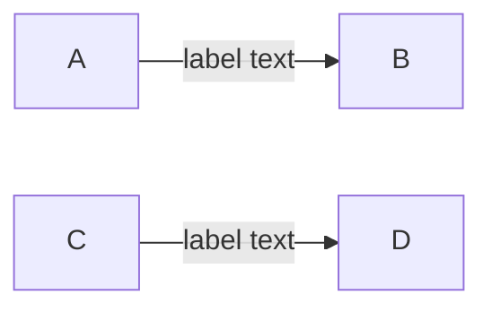

Both syntaxes are valid. Prefer the `|"text"|` form for consistency.

### Multi-line labels

Use `<br/>` for line breaks inside quoted labels:

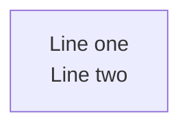

### Subgraph nesting

Subgraphs can be nested. Each must have a unique ID:

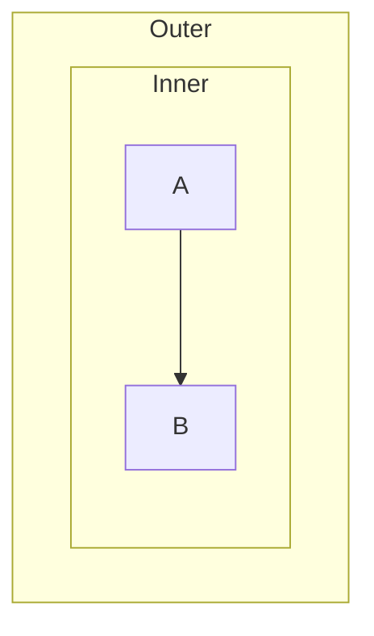

### Styling nodes

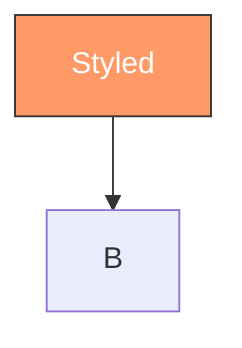

### Styling links (edges)

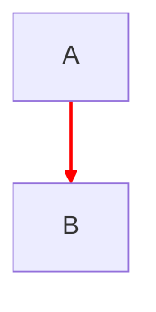

`linkStyle` uses zero-based index of the link in declaration order.

---

## Sequence Diagram Advanced

### Activation shorthand

Use `+` and `-` suffixes on arrows instead of explicit `activate`/`deactivate`:

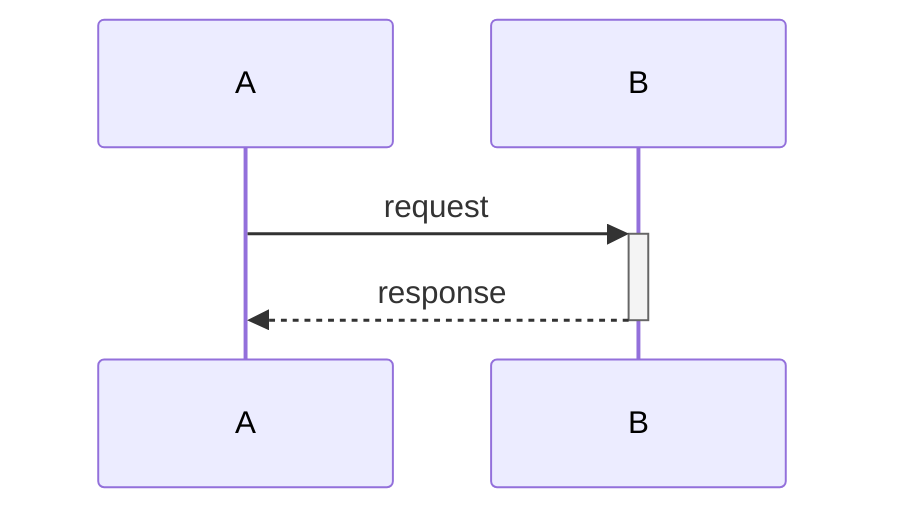

### Loops and conditionals

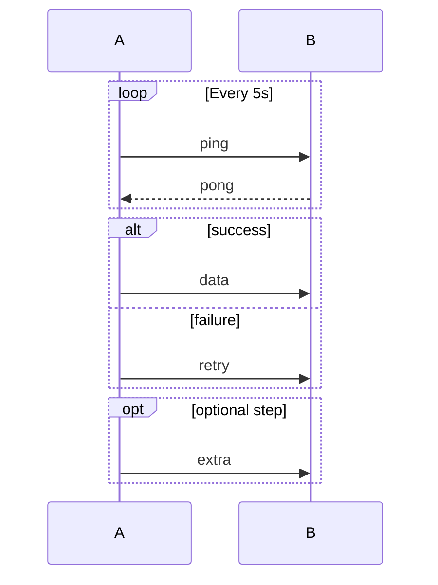

### Parallel execution

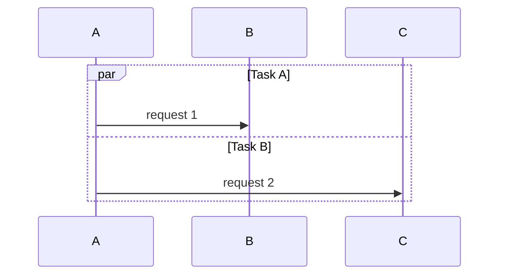

### Autonumbering

Add `autonumber` after the diagram type to auto-label messages:

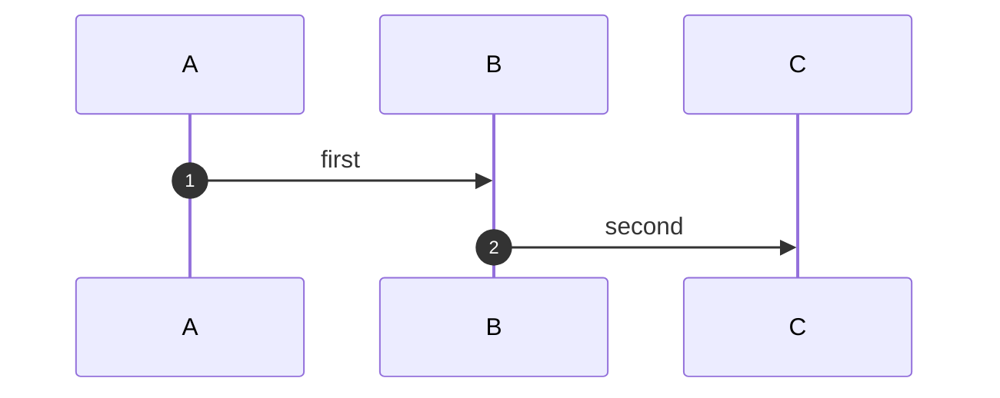

---

## Class Diagram Advanced

### Visibility markers

| Marker | Meaning |
|--------|---------|
| `+` | Public |
| `-` | Private |
| `#` | Protected |
| `~` | Package/Internal |

### Generic types

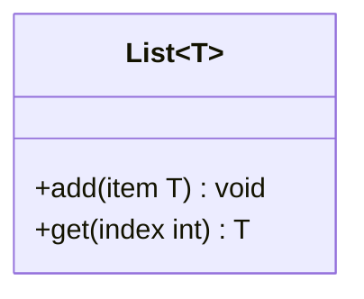

### Annotations

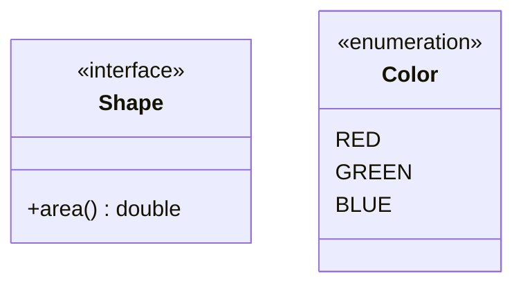

### Namespace grouping

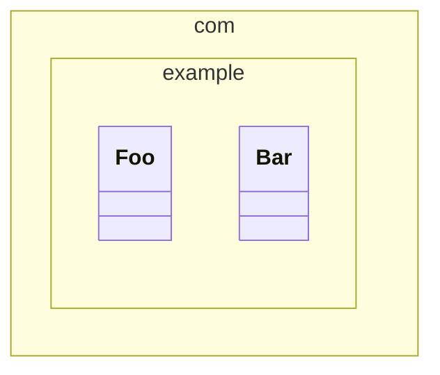

---

## State Diagram Advanced

### Composite (nested) states

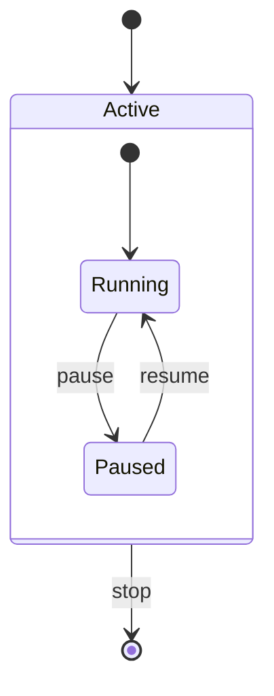

### Choice pseudo-state

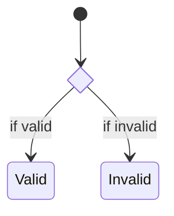

### Fork and join

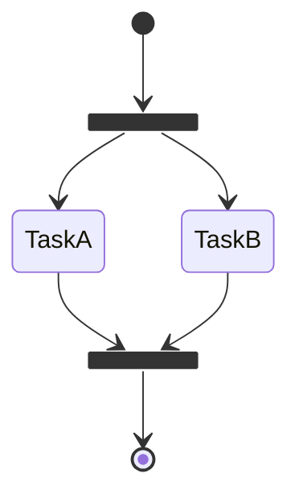

### Notes

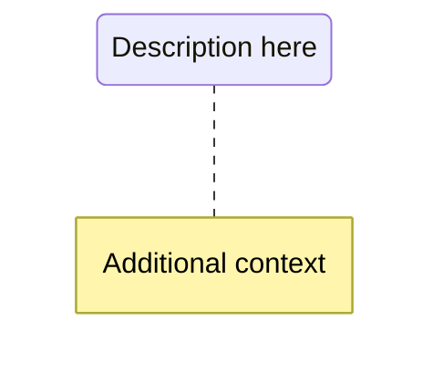

---

## ER Diagram Advanced

### Entity attributes

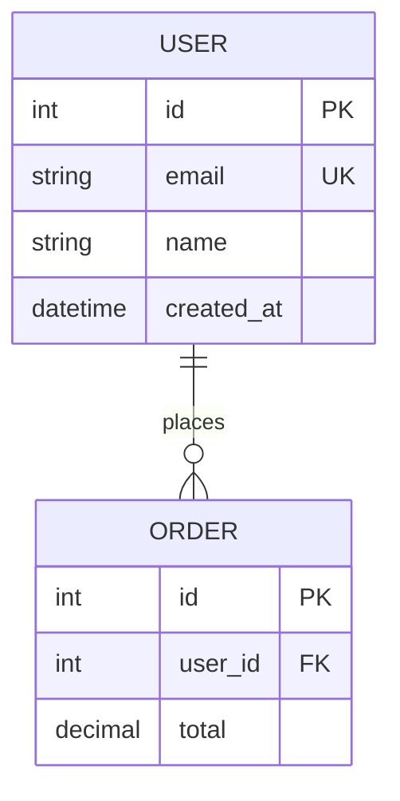

Attribute markers: `PK` (primary key), `FK` (foreign key), `UK` (unique key).

---

## Gantt Chart Advanced

### Task status

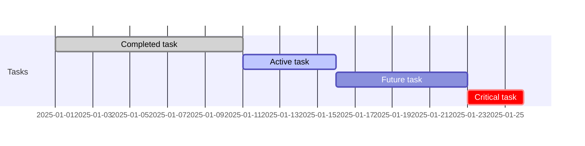

Status keywords: `done`, `active`, `crit`. Can be combined: `crit, active`.

### Milestones

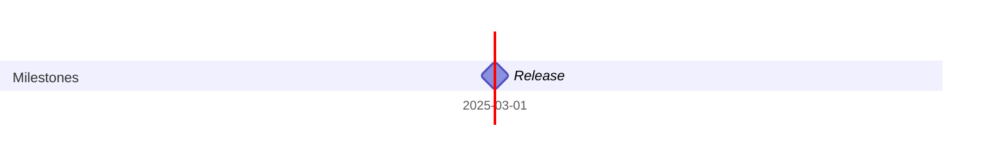

---

## Git Graph Advanced

### Cherry-pick

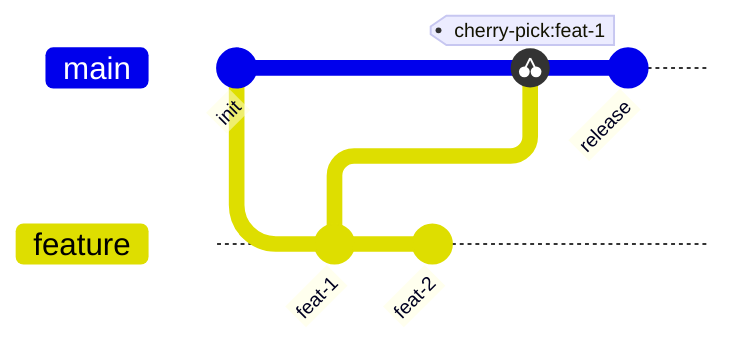

### Tags

```mermaid
gitGraph
  commit id: "init" tag: "v1.0"
  commit id: "fix"
  commit id: "release" tag: "v1.1"
```

### Branch ordering

```mermaid
%%{init: { 'gitGraph': { 'mainBranchOrder': 1 } } }%%
gitGraph
  commit
  branch develop order: 2
  commit
  branch feature order: 3
  commit
```

---

## Theme Configuration

Apply themes via frontmatter directive:

```mermaid
%%{init: {'theme': 'dark'}}%%
flowchart TD
  A --> B
```

Available themes: `default`, `dark`, `forest`, `neutral`, `base`.

### Custom theme variables

```mermaid
%%{init: {'theme': 'base', 'themeVariables': {'primaryColor': '#ff6600', 'primaryTextColor': '#fff'}}}%%
flowchart TD
  A --> B
```
